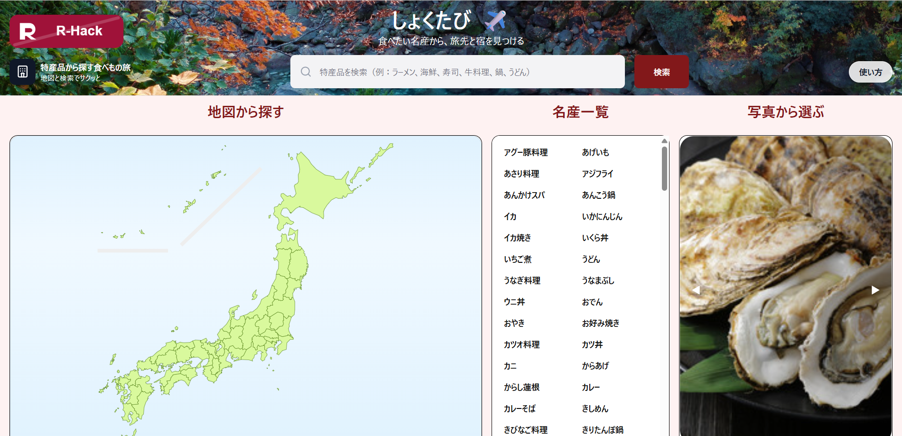

# しょくたび 
<!-- プロダクト名に変更してください -->

<!-- プロダクト名・イメージ画像を差し変えてください -->

## チーム名
チーム17 R-Hack
<!-- チームIDとチーム名を入力してください -->

## 背景・課題・解決されること

### Why（背景）
旅行を計画するとき、多くのサービスは「場所」や「宿」を起点に検索する。 
しかし実際には、

- 「牡蠣が食べたい」
- 「粉もんを食べ歩きしたい」
- 「その土地の名物を味わいたい」

のように、**食べたいもの**が旅の動機になることも多い。

私たちが本当に欲しかったのは、**おいしものを食べたい**という気持ちから、 
行き先も、店も、宿も、迷わず決められる体験

---

### What（課題）
1. 食べたいもの（特産品）から旅行先を探せる導線が弱い。  
2. 食と宿泊の情報が分断されていて、計画に手間がかかる。  
3. 地域の魅力（特産品）が「知って終わり」で、行動につながりにくい。  

結果として、「食べたい」→「どこで？」→「近くの宿は？」を別々のサイトで調べる必要があり、 
旅の計画に時間とストレスがかかる。

---

### How（解決）
**特産品 → 地域 → 飲食店 → 宿泊施設** をワンストップでつなぎ、 
「本当に欲しい」= **食起点** でスムーズに旅が決まる体験を実現

- 特産品を選ぶだけで、対象地域がわかる
- 地図上で、近くの飲食店と宿が同時に見える
- ピン色分けで迷わない（飲食店 / 宿泊）

これにより、**食べたい**を起点に、すぐに旅の形へと具体化できる。
<!-- テーマ「関西をいい感じに」に対して、考案するプロダクトがどういった(Why)背景から思いついたのか、どのよう(What)な課題があり、どのよう(How)に解決するのかを入力してください -->

## プロダクト説明
### しょくたびとは
特産品など食べたいものを起点に、その地域の飲食店と宿泊施設を地図上で提示し、 
「本当にしたい旅」を最短で作る。

---

### 主な機能
- 特産品検索（食べたいものから選ぶ）
- 日本地図・地域表示（行き先候補が直感的にわかる）
- Google Maps連携
- 周辺飲食店検索（Places API）
- 近隣宿泊施設検索
- ピン色分け表示
- 初回ユーザー向けガイド（React Joyride）

<!-- 開発したプロダクトの説明を入力してください -->

## 操作説明・デモ動画
[デモ動画はこちら](https://www.youtube.com/watch?v=fbzGp0XJGq8)
<!-- 開発したプロダクトの操作説明について入力してください。また、操作説明デモ動画があれば、埋め込みやリンクを記載してください -->
### 操作手順

### ① トップ画面（Home）
1. トップ画面で、食べたい特産品を選択
   - 地図・名産一覧・写真から選ぶ、または検索バーに入力

2. 特産品を選択（または検索ボタン押下）すると、検索結果画面（名産地を選ぶ画面）へ遷移する。

---

### ② 検索結果画面（名産地選択）
1. 画面上部に「◯◯の検索結果」が表示され、候補の名産地一覧が出る。
2. 一覧から行きたい名産地を選択する。
3. 名産地を選択すると、MapView画面へ遷移する。

※この画面では「戻る」ボタンで①トップ画面へ戻る。

---

### ③ MapView画面（地図で確認）
MapViewでは、地図上に以下の3種類のピンが表示される。

- 🔵 **青ピン**：検索した特産品（ユーザーが選んだ特産品）の地点  
- 🟡 **黄ピン**：検索していないが、近くにある名産品の地点  
- 🟢 **緑ピン**：宿泊施設  
- 🟠 **オレンジマーカー**：選択中の店舗・施設（強調表示）

ピンをクリックすると、店舗名や施設名などの詳細情報を確認できる。

※この画面では「戻る」ボタンで②検索結果画面へ戻る。

---

### 体験の流れまとめ
トップ画面で特産品を選択
↓  
検索結果画面で名産地を選択  
↓  
MapViewで「特産品・周辺名産品・宿泊施設」を地図で比較  
↓  
旅の計画を具体化

## 注力したポイント

<!-- 開発したプロダクトの中で、特に注力して作成した箇所・ポイントについて入力してください -->

### アイデア面（「本当に欲しいもの」への対応）
- “旅先”ではなく “食べたい” を起点にした設計
- 検索の手間を減らし、行動までを短くする導線
- 特産品の魅力を「知る」から「行く」に変える体験設計

---

### デザイン面
- 直感的に選べるスライダーUI
- 地図とリストの双方向連動設計
- ピンの色分けにより視認性向上
- 選択中店舗の強調表示（視線誘導設計）
- 必要な情報のみを表示する段階的UI
- 情報過多を防ぐミニマルデザイン
- 認知負荷を下げる自動フォーカス機能

---

### その他（技術面・挑戦）
- AWSで公開

## 使用技術

- React
- TypeScript
- Vite
- React Router
- Tailwind CSS

### その他ツール
- Google Maps JavaScript API
- Google Geocoding API
- Google Places API

<!-- 使用技術を入力してください -->

<!--
markdownの記法はこちらを参照してください！
https://docs.github.com/ja/get-started/writing-on-github/getting-started-with-writing-and-formatting-on-github/basic-writing-and-formatting-syntax

-->
